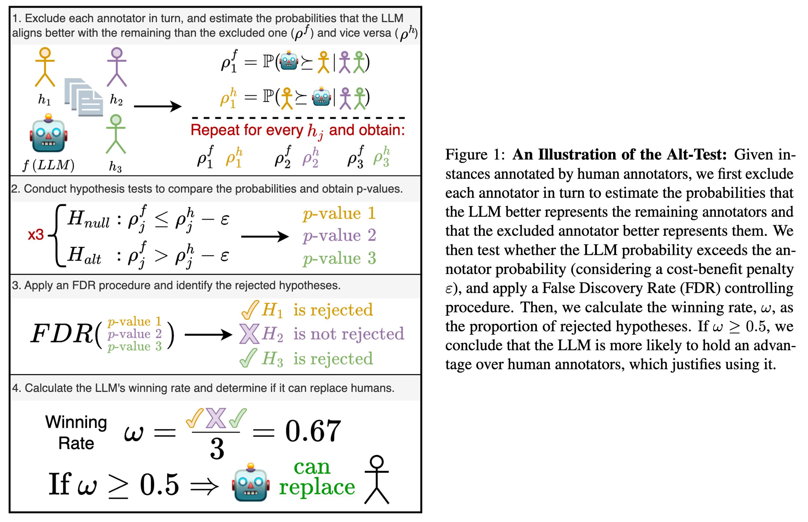

# The Alt-Test: How to Statistically Justify Replacing Human Annotators by LLMs

This repository contains the code and data for the paper <br>
[**The Trial of LLM-as-a-Judge: How to Statistically Justify Replacing Human Annotators by LLMs with the Alt-Test**]() <br>
by [Nitay Calderon](https://nitaytech.github.io/), [Roi Reichart](https://roireichart.com/) and [Rotem Dror](https://rtmdrr.github.io/)
<br>



### Quick Start

We provide an example of how to run the Alt-Test in the `alt_test_example.ipynb` notebook. 
The only requirement is to have the `scipy` package installed:<br>
```bash
pip install scipy
```
Make sure you data is in the correct format:<br>
* **`humans_annotations`**:
  A dictionary of dictionaries where:
  - Outer keys represent annotators (annotator ids).
  - Inner dictionaries with keys representing instances (instance ids) and values representing annotations.
  - **Example:**
    ```python
    {
      'annotator1': {'instance1': 'A', 'instance2': 'B'},
      'annotator2': {'instance1': 'A', 'instance2': 'C', 'instance3': 'A'}
    }
    ```

* **`llm_annotations`**:
  A dictionary with keys representing instances (instance ids) and the values representing LLM predictions.
  - **Example:**
    ```python
    {'instance1': 'A', 'instance2': 'B', 'instance3': 'A'}
    ```

### Datasets


The datasets used in the paper are available in the `data` directory with the following structure:
- `data/`:
  - `dataset_folder/`:
    - `human_annotations.json`: The human annotations for the dataset, keys are human ids and values are dictionaries with the annotations. Each inner dictionary has instance ids as keys and the corresponding annotations as values.
    - `llm_annotations.json`: The LLM annotations for the dataset, keys are LLM names and values are dictionaries with the annotations. Each inner dictionary has instance ids as keys and the corresponding annotations as values. 
      - `prompts.json`: The prompts used for predicting the annotations with the LLMs. Keys are the instance ids and values are dictionaries with the following keys:
        - `text_id`: In many tasks each text/image is annotated with several feature. Typically, each feature is considered as a separate instance. This field is used to group instances that belong to the same text/image.
        - `str_prompt`: The string format of the prompt.
        - `chat_prompt`: The chat format (list of dictionaries) of the prompt.
        - other fields that are specific to the dataset.

**Note 1:** the annotations of the `llm_annotations.json` files were extracted from the LLMs' outputs and transformed to the same format as the human annotations (see the code in the `data/preprocess_outputs.py` file). <br>
**Note 2:** The `prompts.json` file of the LGBTeen dataset is not included due to sensitive information. If you would like access to the LGBTeen dataset, please go to [LGBTeen Dataset repo](https://github.com/nitaytech/LGBTeenDataset).

Please cite the relevant papers when using the datasets.

### Citation

If you use this code or data, please cite our paper:
```
```