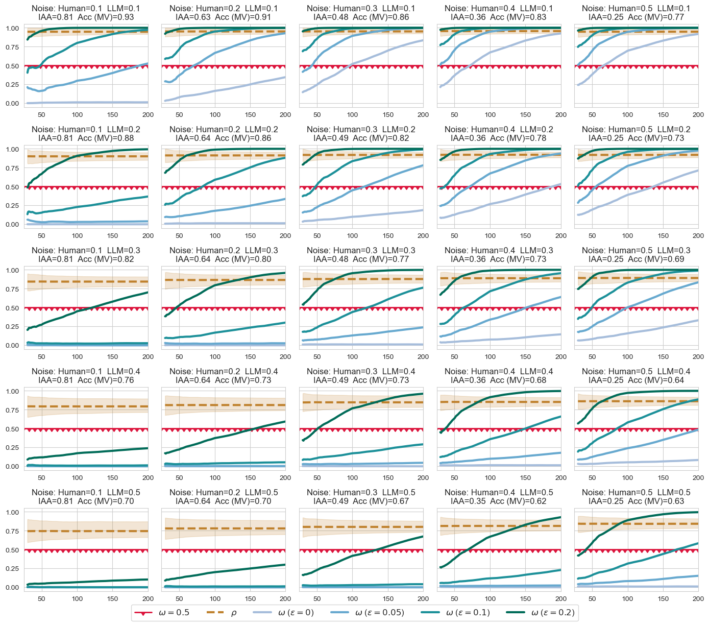
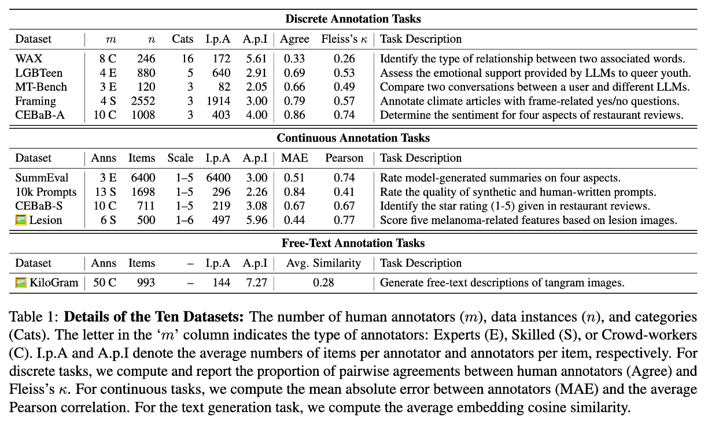

# The Alt-Test: How to Statistically Justify Replacing Human Annotators by LLMs

The alt-test is a statistical procedure designed to determine whether LLM annotations can be used in place of human annotations.  

We provide a Python implementation and an example in the `alt_test_example.ipynb` notebook.  
To run the alt-test, you need 50–100 instances annotated by at least two human annotators, along with the corresponding LLM predictions.  The required data format is described below.  

----

This repository contains the code and data for the paper <br>
[**The Alternative Annotator Test for LLM-as-a-Judge: How to Statistically Justify Replacing Human Annotators with LLMs**](https://arxiv.org/abs/2501.10970) <br>
by [Nitay Calderon](https://nitaytech.github.io/), [Roi Reichart](https://roireichart.com/) and [Rotem Dror](https://rtmdrr.github.io/)
<br>


The approach follows a leave-one-out strategy, where one human annotator is excluded at a time, and the LLM is compared to the remaining human annotators. Similarly, we compare the excluded annotator to the remaining annotators to assess who better represents them: the LLM or the excluded human annotator.  Our procedure also incorporates $\varepsilon$, a cost-benefit hyperparameter that accounts for the efficiency advantages of the LLM (e.g., lower cost, faster processing) by applying a penalty to human annotators.

If the LLM "wins" (i.e., aligns better) in most comparisons, we conclude that the LLM can replace human annotators.

----

### Quick Start

Please read the [FAQ below](#faq).
We provide an example of how to run the Alt-Test in the `alt_test_example.ipynb` notebook.
The only requirement is to have the `scipy` package installed:<br>
```bash
pip install scipy
```
Make sure your data is in the correct format:<br>
* **`humans_annotations`**:
  A dictionary of dictionaries where:
  - Outer keys represent annotators (annotator ids).
  - Inner dictionaries with keys representing instances (instance ids) and values representing annotations.
  - **Example:**
    ```python
    {
      'annotator1': {'instance1': 'A', 'instance2': 'B'},
      'annotator2': {'instance1': 'A', 'instance2': 'C', 'instance3': 'A'}
    }
    ```

* **`llm_annotations`**:
  A dictionary with keys representing instances (instance ids) and the values representing LLM predictions.
  - **Example:**
    ```python
    {'instance1': 'A', 'instance2': 'B', 'instance3': 'A'}
    ```

### Simulation

We provide a simulation tool (see last section in `alt_test_example.ipynb`) to help you decide how many annotated instances are needed to apply the alt-test reliably, and which \$\varepsilon\$ value is appropriate for your use case.
More details about the simulation are provided in Section C in the appendix of the paper.

You can configure the simulation to match your annotation setup by adjusting:

* The number of categories in your task
* The expected reliability of your human annotators (via a noise parameter)
* The expected accuracy of the LLM

Example default configuration:

```python
n_datasets = 20            # Number of simulated datasets
n_boots = 10               # Bootstraps per dataset
sizes = range(30, 201, 10) # Instance sizes from 30 to 200
n_categories = 4           # Number of class labels
noise_annotators = 0.3     # Controls the annotators reliability
noise_llm = 0.3            # Controls the LLM reliability
```

> 💡 Inter-annotator agreement (IAA) decreases with higher noise:
> 0.1 → 0.80, 0.2 → 0.63, 0.3 → 0.48, 0.4 → 0.36

The output includes winning rates and advantage probability across different sample sizes and \$\varepsilon\$ values, allowing you to make informed decisions tailored to your task.



### Datasets



The datasets used in the paper are available in the `data` directory with the following structure:
- `data/`:
  - `dataset_folder/`:
    - `human_annotations.json`: The human annotations for the dataset, keys are human ids and values are dictionaries with the annotations. Each inner dictionary has instance ids as keys and the corresponding annotations as values.
    - `llm_annotations.json`: The LLM annotations for the dataset, keys are LLM names and values are dictionaries with the annotations. Each inner dictionary has instance ids as keys and the corresponding annotations as values. 
      - `prompts.json`: The prompts used for predicting the annotations with the LLMs. Keys are the instance ids and values are dictionaries with the following keys:
        - `text_id`: In many tasks each text/image is annotated with several feature. Typically, each feature is considered as a separate instance. This field is used to group instances that belong to the same text/image.
        - `str_prompt`: The string format of the prompt.
        - `chat_prompt`: The chat format (list of dictionaries) of the prompt.
        - other fields that are specific to the dataset.

**Note 1:** the annotations of the `llm_annotations.json` files were extracted from the LLMs' outputs and transformed to the same format as the human annotations (see the code in the `data/preprocess_outputs.py` file). <br>
**Note 2:** The `prompts.json` file of the LGBTeen dataset is not included due to sensitive information. If you would like access to the LGBTeen dataset, please go to [LGBTeen Dataset repo](https://github.com/nitaytech/LGBTeenDataset).

Please cite the relevant papers when using the datasets.

### Citation

If you use this code or data, please cite our paper:
```
@inproceedings{calderon-etal-2025-alternative,
    title = "The Alternative Annotator Test for {LLM}-as-a-Judge: How to Statistically Justify Replacing Human Annotators with {LLM}s",
    author = "Calderon, Nitay  and
      Reichart, Roi  and
      Dror, Rotem",
    editor = "Che, Wanxiang  and
      Nabende, Joyce  and
      Shutova, Ekaterina  and
      Pilehvar, Mohammad Taher",
    booktitle = "Proceedings of the 63rd Annual Meeting of the Association for Computational Linguistics (Volume 1: Long Papers)",
    month = jul,
    year = "2025",
    address = "Vienna, Austria",
    publisher = "Association for Computational Linguistics",
    url = "https://aclanthology.org/2025.acl-long.782/",
    pages = "16051--16081",
    ISBN = "979-8-89176-251-0",
    abstract = "The ``LLM-as-an-annotator'' and ``LLM-as-a-judge'' paradigms employ Large Language Models (LLMs) as annotators, judges, and evaluators in tasks traditionally performed by humans. LLM annotations are widely used, not only in NLP research but also in fields like medicine, psychology, and social science. Despite their role in shaping study results and insights, there is no standard or rigorous procedure to determine whether LLMs can replace human annotators. In this paper, we propose a novel statistical procedure, the Alternative Annotator Test (alt-test), that requires only a modest subset of annotated examples to justify using LLM annotations. Additionally, we introduce a versatile and interpretable measure for comparing LLM annotators and judges. To demonstrate our procedure, we curated a diverse collection of ten datasets, consisting of language and vision-language tasks, and conducted experiments with six LLMs and four prompting techniques. Our results show that LLMs can sometimes replace humans with closed-source LLMs (such as GPT-4o), outperforming the open-source LLMs we examine, and that prompting techniques yield judges of varying quality. We hope this study encourages more rigorous and reliable practices."
}
```

# FAQ

This FAQ is based on the FAQ section in the paper.

#### Q: How should I report the alt-test results?
**A:** We recommend the following best practices for applying and reporting the alt-test results:

1. Provide details about the human annotators, including their profile, level of expertise, annotation guidelines, training, and the overall process.
2. Explain the rationale behind the choice of $\varepsilon$ (see the relevant question below for guidance).
3. For selecting the number of instances, see the relevant question below.
4. Report a measure of reliability for the human annotators, such as inter-annotator agreement (e.g., Cohen’s κ) or correlation measures. This is essential to ensure that the annotators are sufficiently reliable and the $\varepsilon$ value is appropriate.
5. For selecting the LLM-as-a-judge, report the average advantage probability (ρ), clearly state which LLMs are compared, and provide their corresponding ρ values.
6. Report the winning rate of the selected LLM.

#### Q: Why not use an Inter-Annotator Agreement (IAA) measure?
**A:**  Our procedure is a type of IAA, but unlike traditional IAA measures (such as Cohen’s kappa), which assess agreement among a group of annotators, our goal is to \textit{compare} the LLM to the group to determine whether it can replace them.

#### Q: Why not use a traditional measure such as F1 score or accuracy?
**A:**  To compare the LLM to human annotators and to address the `replacement question' (i.e., whether the LLM can be used instead of the annotators), one might consider traditional LLM-human alignment measures (e.g., the F1 score or a correlation between the LLM and the majority vote label). However, answering the replacement question requires statistical rigor. Even though a statistical test can check if the traditional measure exceeds a predefined threshold, there is no universal standard for setting it, which may vary across datasets and setups. Additionally, traditional measures only evaluate whether the LLM matches human performance, not whether it provides a better alternative.
In contrast, our procedure involves statistical practices and provides clear passing criteria. Most importantly, it directly answers the replacement question by using a leave-one-out approach -- excluding one annotator at a time and assessing whether the LLM better represents the remaining annotators than the excluded one.

#### Q: Why do you recommend at least three human annotators and not two?
**A:**  While our procedure can be used with two annotators, we believe it is less reliable. With only two, the procedure simply checks whether the LLM aligns more with one annotator than the other, lacking a consensus signal. This makes results more sensitive to individual biases. With at least three annotators, the procedure better evaluates whether the LLM represents the broader group. Obviously, the more annotators, the better, as this increases the reliability, reduces the influence of individual biases, and provides a more robust consensus signal for comparison.

#### Q: What if I have annotations from a single human annotator?
**A:**  Since our procedure requires at least two annotators, we recommend recruiting additional annotators for the alt-test. However, if the single annotator is an expensive expert (or you trust their annotations) and cannot recruit others at the same expertise level, you can instead recruit lower-quality annotators and test who better represents the expert: the LLM or the newly recruited annotators. We refer to this as the single-expert scenario and provide a detailed discussion on adjusting our procedure in Appendix Section "A Single Expert Annotator".

#### Q: How do I select the $\varepsilon$ value?
**A:**  We discuss this topic in detail in \S\ref{sub:threshold}. Note that $\varepsilon$ is the cost-benefit hyperparameter, where higher values indicate greater efficiency advantages of the LLM. As a rule of thumb, for expert annotators (reliable but expensive, sometimes inaccessible), set $\varepsilon=0.2$. For skilled annotators (e.g., undergraduate students, trained workers, etc., who are less reliable than experts), set $\varepsilon=0.15$. For crowd-workers, set $\varepsilon=0.1$. Moreover, the choice of $\varepsilon$ should depend on the reliability of the human annotators. When IAA is low, a smaller $\varepsilon$ should be used. The simulation-based analysis in Appendix~\ref{app:simulations} can help understand the effect of IAA on the alt-test, and guide the selection of an appropriate $\varepsilon$.

#### Q: How many instances should I annotate?
**A:**  We discuss this topic in detail in \S\ref{sub:instances}. To ensure the normality assumption of the t-test holds, you should have at least 30 instances. Our analysis shows that annotating between 50 and 100 instances is sufficient in most cases. Obviously, the more annotated instances, the better, as this increases the statistical power of the t-test and the likelihood of the LLM passing the alt-test. We encourage researchers to conduct simulation analyses similar to the one presented in Appendix~\ref{app:simulations} to help determine the required number of instances. The simulation code is available in our GitHub repository. It can be customized by adjusting parameters such as the number of categories or the expected IAA to reflect the characteristics of their data.

#### Q: What if I have fewer than 30 annotated instances per annotator?
**A:**  In this case, the normality assumption of the t-test does not hold, so a non-parametric test, such as the Wilcoxon signed-rank test, should be used instead. Still, we strongly recommend having annotators label additional instances. See the next question for an alternative approach.

#### Q: I have two sets of human annotators. Can I combine annotators from the first set with the second set to increase the number of instances per annotator?
**A:** If you have two separate sets of annotators who annotated different, non-overlapping instances, you can artificially increase the number of instances per annotator by pairing them across sets. 
For example, suppose Set 1 consists of three annotators who annotated 20 instances, and Set 2 consists of another three annotators who annotated a different set of 20 instances. You can combine an annotator from Set 1 with an annotator from Set 2, treating them as a single "combined annotator" with 40 instances. To improve robustness, you can form multiple such pairs and report the average winning rate across different pairing combinations.
While this approach can increase the number of annotated instances per annotator, it is not ideal. The best practice is still to annotate more instances. Combining annotators like this may also increase the variance of the statistics (since we combine instances annotated by different distributions). This could lead to higher p-values, making the LLM fail.

#### Q: What if annotators use a different scale?
**A:**  If annotators use different portions of the rating scale, normalization can help align their scores before applying our procedure. For example, suppose annotators evaluate summaries' quality on a 1–5 Likert scale. One annotator uses the full range (1, 2, 3, 4, 5), while another only uses a restricted range (e.g., 2, 3, and 4). To address this, you can normalize scores for each annotator by standardizing (subtracting the mean and dividing by the standard deviation) or min-max scaling (rescaling values to a 0–1 range). Another option is to use rank-based transformation, see the next question. 

#### Q: What if I care about ranking rather than exact scores?
**A:**  In some cases, the exact match between LLM predictions and human annotations may not be as important as the relative ordering of instances. For example, if the goal is to ensure that higher-scored instances by humans are also ranked higher by the LLM. To evaluate this, we can adapt our procedure to operate on ranks instead of raw scores. Specifically, we create a separate ranked list for each human annotator and the LLM by assigning ranks to instances based on their annotated scores (e.g., the lowest score gets rank 1). We then apply our procedure to these ranks, replacing the original annotations. The alignment scoring function can be negative RMSE, computed for each instance based on the difference between its rank assigned by the LLM and its rank assigned by the human annotator.

#### Q: What if I have a skewed label distribution?
**A:**  In Appendix Section "Handling Imbalanced Labels", we discuss modifications to our procedure to account for label imbalance in the dataset.

#### Q: How to test if the LLM can be used in several environments or domains?
**A:**  When evaluating whether an LLM-as-a-judge can be used across multiple environments or domains, it is important to evaluate it in each setting independently while also controlling for the overall False Discovery Rate (FDR). For example, suppose we have five domains, each with three human annotators, resulting in 15 comparisons between the LLM and humans. The FDR-controlling procedure should be applied to the 15 p-values to ensure statistical rigor. Additionally, the winning rate should be computed separately for each environment, and the results should be summarized as: \\
"The LLM passes the alt-test in X out of 5 domains."
In cases of hundreds of environments, collecting labeled data from at least three annotators per environment may be impractical. This remains an open challenge, but it offers promising directions for future work, such as sampling representative environments rather than testing all of them.

#### Q: How to test who better represents human experts? LLMs or crowd-workers?
**A:**  We discuss this scenario in Appendix Section "A Single Expert Annotator".

#### Q: How to test whether LLMs outperform humans? (and not whether they can replace them)?
**A:**  We discuss this scenario in Appendix Section "Testing If LLMs Outperform Humans".

#### Q: What if I trust one annotator more than the others?
**A:**  In Appendix Section "Incorporating Annotator Quality", we discuss simple modifications to our procedure to account for variations in annotator quality.